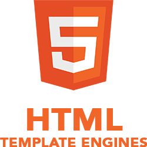
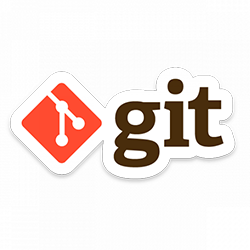
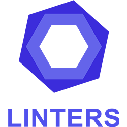

## I'm Serhii Kostiv

- I'm From Ukraine (Ivano-Frankivsk);
- 3+ Years Experience in Front-end Development;

### Connect with me:

[][website]&nbsp;
[][linkedin]&nbsp;
[][email]

### Tech Stack:

<table>
  <tr>
    <td>
      
    </td>
    <td>
      
    </td>
    <td>
      
    </td>
    <td>
      
    </td>
    <td>
      
    </td>
  </tr>
  <tr>
    <td>
      
    </td>
    <td>
      
    </td>
    <td>
      
    </td>
    <td>
      
    </td>
    <td>
      
    </td>
  </tr>
  <tr>
    <td>
      
    </td>
    <td>
      
    </td>
    <td>
      
    </td>
    <td>
      
    </td>
    <td>
      
    </td>
  </tr>
  <tr>
    <td>
      
    </td>
    <td>
      
    </td>
    <td>
      
    </td>
    <td>
      
    </td>
    <td>
      
    </td>
  </tr>
  <tr>
    <td>
      
    </td>
    <td>
      
    </td>
    <td>
      
    </td>
  </tr>
</table>

### Tools:

<table>
  <tr>
    <td>
      
    </td>
    <td>
      
    </td>
    <td>
      
    </td>
  </tr>
  <tr>
    <td>
      
    </td>
    <td>
      
    </td>
  </tr>
</table>

_**Note:** hover over a skill to get detailed information about it.   The information will be displayed as a tooltip._

[linkedin]: https://www.linkedin.com/in/serhii-kostiv/
[email]: mailto:kostiv.serhii@gmail.com
[website]: https://serhiikostiv.herokuapp.com/
